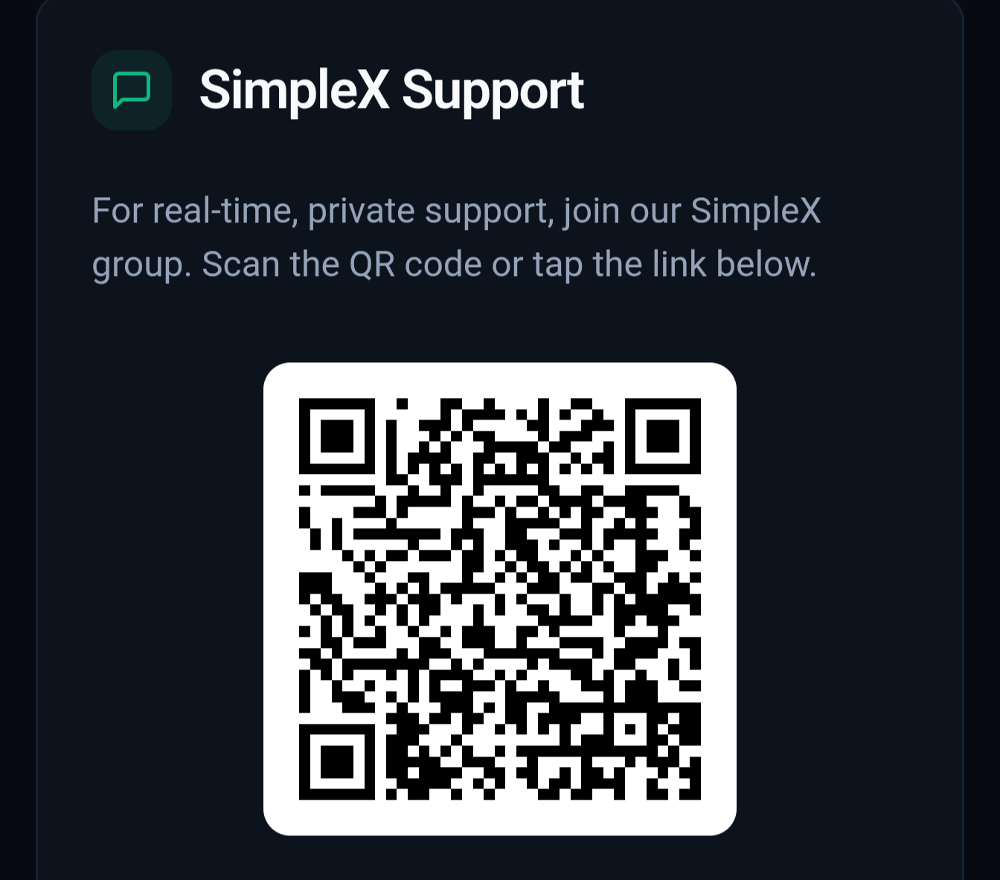

# 0xNull

**Private Infrastructure for the Permissionless Economy**

**Live Site:** [0xnull.io](https://0xnull.io) | **Tor:** [onullluix4iaj77wbqf52dhdiey4kaucdoqfkaoolcwxvcdxz5j6duid.onion](http://onullluix4iaj77wbqf52dhdiey4kaucdoqfkaoolcwxvcdxz5j6duid.onion)

## Overview

0xNull is a privacy-first platform offering prediction markets, cryptocurrency swaps, AI services, and an anonymous marketplace—all settled in Monero (XMR) with no KYC requirements.

**Built for humans and machines. No accounts. No identity. Just XMR and outcomes.**

---

## Core Products

### 🎯 Prediction Markets

Parimutuel betting on sports, esports, and crypto prices with automated oracle resolution.

**How it works:**
- All bets go into a pool (YES pool + NO pool)
- Winners split the losers' pool proportionally
- 0.4% fee on winnings only — stakes returned fee-free
- One-sided markets (no opposing bets) = full refund, no fee

**Coverage:**
- **Sports:** NFL, NBA, MLB, NHL, Premier League, La Liga, Serie A, Bundesliga, Ligue 1, Champions League, F1, Cricket, and 150+ leagues
- **Esports:** CS2, Valorant, League of Legends, Dota 2, StarCraft II, and 15+ titles with live Twitch integration
- **Crypto:** BTC/ETH price targets via CoinGecko oracle

**Technical:**
- Subaddress-based deposit matching (unique address per bet)
- Automated resolution via The Odds API (sports) and CoinGecko (crypto)
- View keys available for independent pool verification
- Multi-bet API for placing multiple legs with single deposit

**vs Competitors:**

| Platform | Fee Model | Effective Rate | Privacy |
|----------|-----------|----------------|---------|
| 0xNull | 0.4% on winnings | ~0.2% average | Full (XMR, no KYC) |
| Polymarket | 0% (VC subsidized) | Spread costs | None (on-chain) |
| Kalshi | 0.07%-7% taker | ~1.2% | None (full KYC) |
| PredictIt | 10% + 5% withdrawal | ~15% | None (full KYC) |
| Traditional Bookies | Spread/vigorish | 5-15% | None (bank trail) |

### 💱 Crypto Swaps

Non-custodial cryptocurrency swaps via Trocador aggregation.

- Swap any supported crypto to XMR (or vice versa)
- No accounts, no KYC
- Best rates aggregated across multiple exchanges
- Direct wallet-to-wallet settlement

### 🤖 AI Services

Access to Claude, GPT, and other models for XMR.

- Pay-per-use, no subscription
- No account required
- Powered by NanoGPT routing
- Voice, text, and specialized models available

### 🛒 Anonymous Marketplace

Buy and sell physical goods, digital products, and services.

- No seller accounts required for browsing
- XMRBazaar integration (curated referral listings)
- Partner merchant network
- User-created listings via Supabase
- **Categories:** Electronics, Digital Goods, Services, Accessories, Tools & Outdoors, Health & Wellness, and more

---

## Why 0xNull?

### For Users

- **No KYC** — Scan QR, send XMR, done
- **No accounts** — No email, no password, no identity
- **No geo-blocking** — Works anywhere
- **Verifiable** — View keys let you audit pool balances
- **Low fees** — 0.4% on winnings beats 5-15% vigorish

### For AI Agents

- **Permissionless API** — No API keys required for market data
- **Programmatic betting** — Agents can place bets autonomously
- **No human gatekeeping** — No KYC means machines can participate
- **Multi-bet support** — Single deposit, multiple legs, one payout address

### Architecture Philosophy

> Decentralization is a means, not an end

The goals: censorship resistance, privacy, permissionless access

Centralized backend + Monero settlement + accountable operator = better tradeoffs than "trustless" smart contracts with surveillance

---

## Technical Architecture

### Prediction Markets Backend

- 4x monero-wallet-rpc instances (ports 18082-18085) with round-robin load balancing
- Pool wallets created lazily on first bet per market
- Subaddresses generated via `create_address` RPC call
- Scanner polls every 2 minutes, matches deposits by address index
- Auto-resolution cron for sports/esports/crypto oracles

### Oracles

- **Sports:** The Odds API (70+ leagues)
- **Esports:** Tapology + ScraperAPI proxy (Russian MMA, global esports)
- **Crypto:** CoinGecko + Binance price feeds

### Stack

| Layer | Technology |
|-------|------------|
| Frontend | React 18, TypeScript, Vite |
| Styling | Tailwind CSS, shadcn/ui |
| Backend | Supabase (PostgreSQL, Edge Functions) |
| Predictions | Python/Flask, monero-wallet-rpc |
| Payments | Trocador AnonPay, direct XMR |
| AI | NanoGPT API |

### Key Integrations

| Partner | Integration |
|---------|-------------|
| Trocador | Swap aggregation, AnonPay |
| NanoGPT | AI model routing |
| SporeStack | Anonymous VPS provisioning |
| LNVPN | eSIM affiliate |
| The Odds API | Sports oracle data |
| XMRBazaar | Marketplace referrals |

---

## Routes

| Path | Description |
|------|-------------|
| `/` | Landing page |
| `/sports-predictions` | Sports betting markets |
| `/esports-predictions` | Esports betting with live streams |
| `/predictions` | Crypto price predictions |
| `/swaps` | Cryptocurrency swaps |
| `/ai` | AI services |
| `/browse` | Marketplace |
| `/how-betting-works` | Parimutuel explainer |
| `/listing/:id` | Individual listing |
| `/checkout/:orderId` | Payment flow |

---

## API (For AI Agents)

### Get Available Markets

```
GET /api/predictions/markets
```

### Place Bet

```
POST /api/predictions/bet
{
  "market_id": "sports_xxx",
  "side": "YES" | "NO",
  "amount_usd": 10.00,
  "payout_address": "4xxxxx..."
}
```

### Multi-Bet (Prediction Slip)

```
POST /api/predictions/multibet
{
  "bets": [
    {"market_id": "...", "side": "YES", "amount_usd": 5},
    {"market_id": "...", "side": "NO", "amount_usd": 5}
  ],
  "payout_address": "4xxxxx..."
}
```

Returns single deposit address for all legs.

---

## Support

**SimpleX Chat** — End-to-end encrypted, no phone/email required (only contact method)

<p align="center">
  
</p>

<p align="center">No email support. Privacy by default.</p>

---

## Security Model

| Aspect | 0xNull | Polymarket |
|--------|--------|------------|
| Operator | Public, accountable | Anonymous smart contract |
| User Privacy | Invisible (XMR) | Fully traced (on-chain ETH) |
| Custody | Hours/days (bet window) | Continuous |
| Attack Surface | One guy you can sue | $9B smart contract honeypot |
| Verification | View keys | Etherscan |

> "Decentralized surveillance" vs "Accountable operator + invisible users"

---

## Legal

- Platform operates offshore
- XMR-only, no fiat touchpoint
- No KYC = no user data to subpoena
- Operator is public and accountable
- User responsibility to comply with local laws

---

## Links

- **Live:** [0xnull.io](https://0xnull.io)
- **Tor:** [onullluix4iaj77wbqf52dhdiey4kaucdoqfkaoolcwxvcdxz5j6duid.onion](http://onullluix4iaj77wbqf52dhdiey4kaucdoqfkaoolcwxvcdxz5j6duid.onion)
- **SimpleX:** Contact via site
- **XMRBazaar:** [xmrbazaar.com](https://xmrbazaar.com)
- **Trocador:** [trocador.app](https://trocador.app)

---

## License

Proprietary — Margin Syndicate Limited

---

**Bet Privately. No accounts. No KYC. No limits. Just XMR and outcomes.**
